# Observasjonssystem
På denne siden deler jeg mitt obsidian-hvelv, som jeg bruker i observasjoner.

Her får du informasjon om hvordan komme i gang med systemet. 

**Merk!** Veiledningen gjelder foreløpig bare iPhone, Mac og iCloud.

> Ved å laste ned mappen "tab-observasjonssystem" og legge den til Obsidian-mappe på iCloud opprettes det et hvelv, som du kan bruke som utgangspunkt for et digitalt observasjonsverktøy. 

Oppsummert fremgangsmåte:
1. Last ned app på iphone (husk synch til icloud, og opprett hvelv)
2. Last ned app på mac (vis skulte filer i finder: `⌘` + `⇪` + `.` )
3. Last ned obsidian-hvelvet fra github (unzip og flytt til obsidian-mappe i icloud drive)

## 1) Last ned obsidian til iphone
1. Søk "Obsidian" i app-store eller bruk [denne lenken](https://apps.apple.com/us/app/obsidian-connected-notes/id1557175442)
2. Last ned appen til telefon
   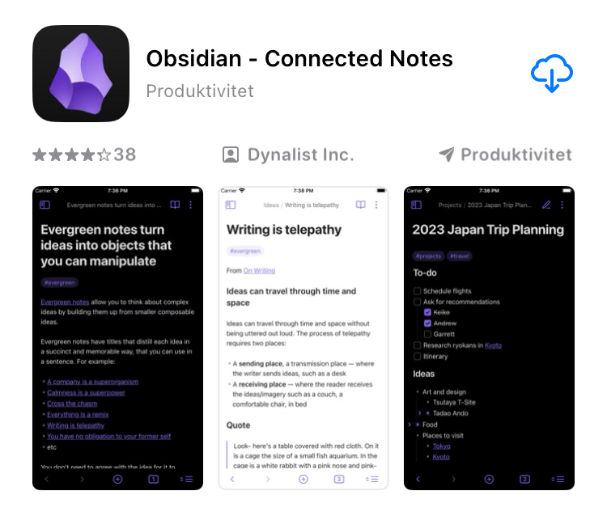
3. Åpne appen og velg "Set up synch"
4. Velg **synkronisering til iCloud**.
   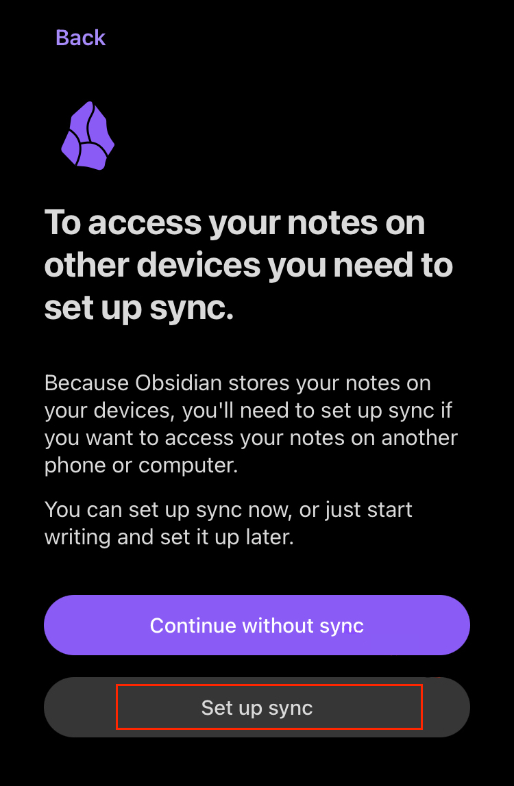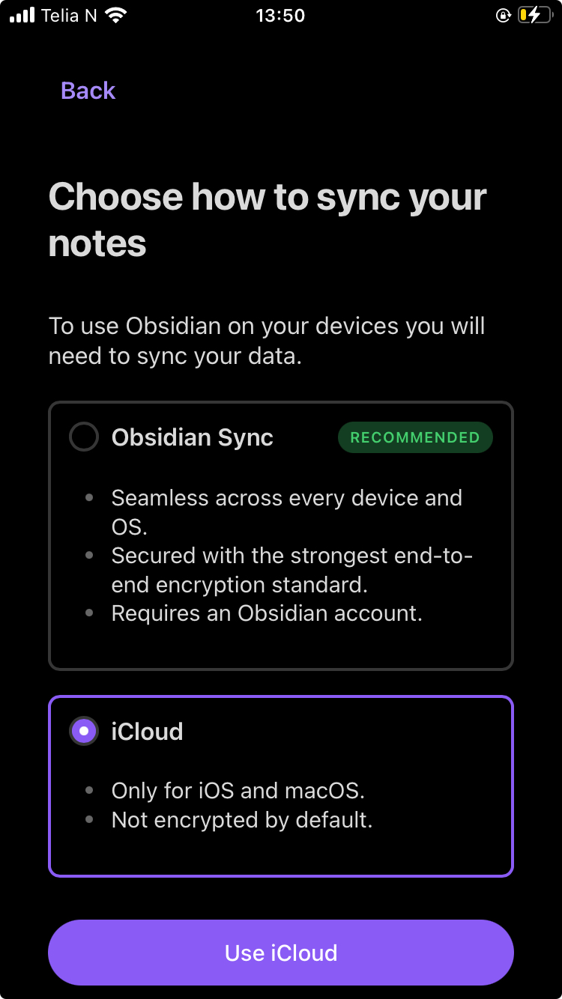

5. Opprett et hvelv (Vault) med navn *Tab-observasjonssystem* (Kan endres senere) - Sørg for at "Store in icloud" er på.
   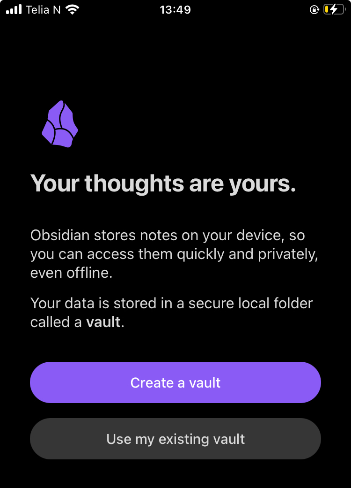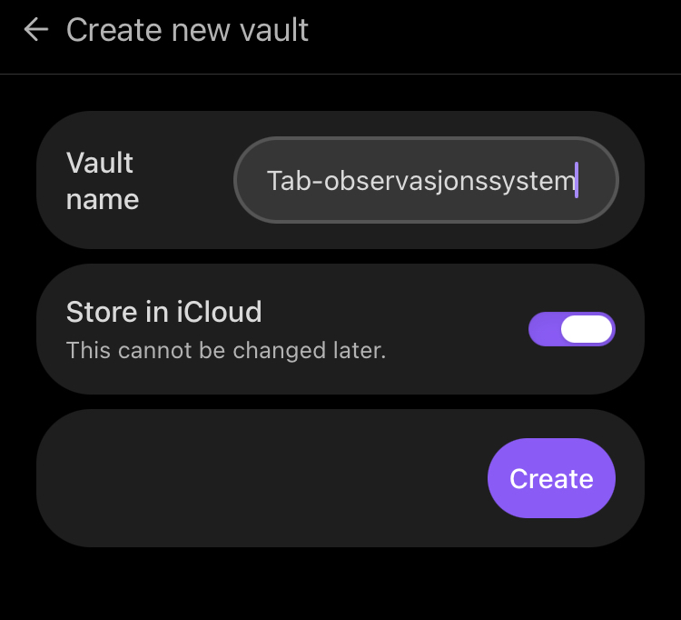

6. Åpne **filer**-appen, 
7. Åpne iCloud Drive 
8. Kontroller at det er opprettet en mappe "Obsidian"
   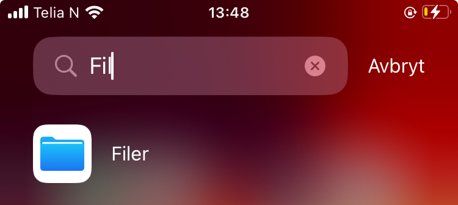 
   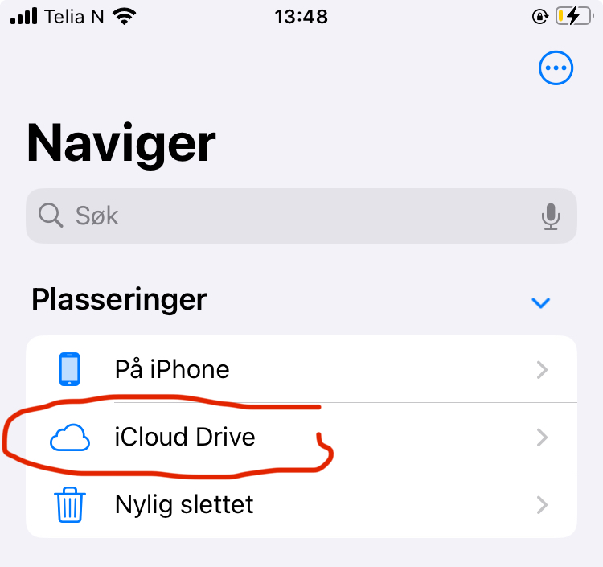
   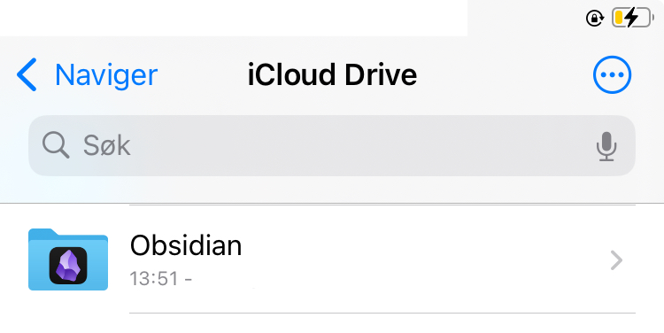

9. Trykk og hold på mappen så du får opp meny (se bilde under) og velg "Behold nedlastning" (dette gjør at obsidian bruker mindre tid på å åpne seg)
    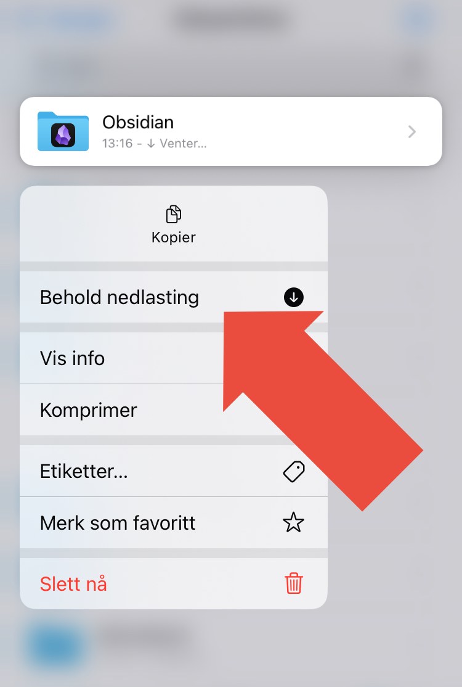
   

## 2) Last ned obsidian til mac

1. Gi til obsidian sin hjemmeside ([obsidian](https://obsidian.md/download) ) - Her finner du lenker til alle mulige platformer (windows, PC, mac m.m.)
2. Last ned appen til datamaskinen
3. Åpne et finder-vindu, 
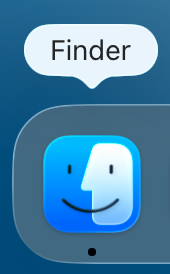 

4. Gå til iCloud Drive. 
   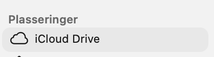

5. Kontroller at obsidian-mappen er synkronisert til iCloud fra iPhone - og åpne mappen
   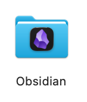
6. Åpne mappen "Tab-observasjonssystem" (som du opprettet på telefon tidligere) 
7. Hvis mappen fremstår å være tom (se bildet under) bruk hurtigtast: `⌘` + `⇪` + `.` (trykk samtidig på knappene command, shift og punktum på tastaturet)
   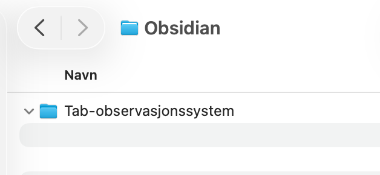  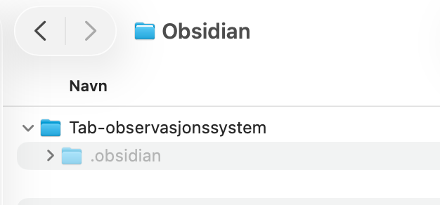

 
8. Slett mappen ".obsidian"

### Last ned mappe fra Github 
Last ned mappen "Observasjonssystem"
1. Trykke på "<> Code" (Blå knapp på denne siden, over mappene) 
   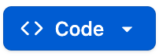
2. Trykk på fanen "Local" og "Download Zip"
   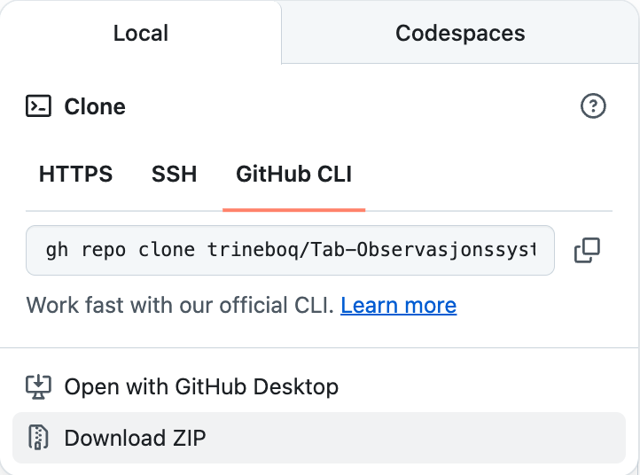
3. En zip-fil blir lastet ned. Pakk ut denne og flytt mappen "Observasjonssystem over i obsidian-mappe på icloud. 
4. Velg "Erstatt" på spørsmål om dette.
5. Åpne obsidian-appen fra mac 
6. Opprett nytt hvelv fra mappe
    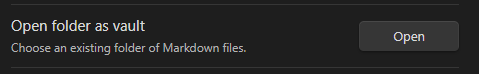
7. Velg mappen "Observasjonssystem".
8. Når appen åpnes blir du spurt om du stoler på Godkjenn på spørsmål om stoler på forfatteren av hvelvet:
   
Velg en av alternativene ut fra dine preferanser.

Du kan nå begynne å bruke observasjonssystemet.

### "Honorable mentions" 
Her har jeg samlet lenker til andre plugins, temaer, snippets m.m. som gjør dette systemet mulig:

**Essensielle plugins:**
* [Gay toolbar](https://github.com/ChasKane/gay-toolbar)
* [Templater](https://github.com/SilentVoid13/Templater)
* [Quick Add](https://github.com/chhoumann/quickadd)
* [Commander](https://github.com/phibr0/obsidian-commander)
* [Obsidian auto-link](https://github.com/zolrath)

**Utseende:**
* [Admonitions](https://github.com/javalent/admonitions)
* [Style settings](https://github.com/mgmeyers/obsidian-style-settings)
* [Border-theme](https://github.com/Akifyss)
* [Modular CSS Layout (MCL) snippets](https://efemkay.github.io/obsidian-modular-css-layout/)
